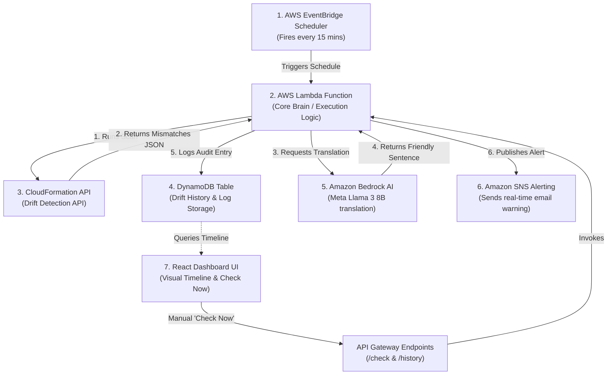

# AWS Infrastructure Drift Control & AI Insights 🛡️🤖

An automated, serverless system designed to detect infrastructure drift in AWS CloudFormation stacks, translate complex JSON differences into plain-English summaries using Amazon Bedrock (Meta Llama 3 8B), send real-time alerts, and visualize the history on a premium glassmorphic React dashboard.

---

## 🏗️ System Architecture & Workflow



---

## ✨ Features

* **Real-time Drift Detection:** Scans stack resources asynchronously for status modifications or deletions.
* **GenAI Translation (Meta Llama 3 8B):** Converts raw, complex property differences (like port additions or public S3 overrides) into a single, concise, easy-to-read English sentence.
* **Audit Trail History:** Stores drift logs inside an on-demand DynamoDB table for timeline audits.
* **Email Alerts:** Automatically fires warning emails via Amazon SNS when a resource drifts from its template.
* **Premium Dashboard:** Built using React + Vite + Vanilla CSS, showcasing backdrop blurs, glow effects, custom filter actions, and side-by-side diff inspectors.
* **Simulation Mode:** Run the dashboard in full-fidelity sandbox mode with mock data, or connect it directly to your running local/AWS API Gateway endpoint.

---

## 📁 Repository Structure

```text
├── lambda_functions/
│   ├── drift_detector.py      # Core Lambda: CFN check + Bedrock client + SNS alerts + DynamoDB logs
│   └── history_retriever.py   # Lambda: Queries DynamoDB logs for the React frontend
├── dashboard/
│   ├── src/
│   │   ├── App.jsx            # React timeline view, detail modal, and config inputs
│   │   ├── index.css          # Glassmorphism dark-mode styles and CSS variables
│   │   └── mockData.js        # Realistic simulated data logs
│   └── index.html             # Google font imports and metadata
├── template.yaml              # AWS Serverless Application Model (SAM) configuration
├── test_drift_detector.py     # Local unit test suite with patched Boto3 clients
├── local_api_server.py        # Python local server mimicking AWS API Gateway locally
└── README.md                  # Project documentation
```

---

## 🚀 Quick Start (Local Testing)

You can run the full system client-server loop locally on your machine without deploying anything to AWS first:

### 1. Launch the React Dashboard
```bash
cd dashboard
npm install
npm run dev
```
Open your browser to `http://localhost:5173/`.

### 2. Start the Local API Server
In a new terminal window in the root directory, run:
```bash
python local_api_server.py
```
This runs a local mock database API at `http://localhost:8080`.

### 3. Connect & Verify
1. On the React dashboard, toggle **Mock Demo Mode** to **OFF** (top-right).
2. Change the **API Gateway Endpoint** in the right-hand panel to: `http://localhost:8080`.
3. Click **Reload Data**.
4. Click **Check Now** to trigger a manual scan request. Watch the timeline update in real time with simulated drift and healthy events!

---

## ☁️ Deployment to AWS (Production)

### 1. Request Bedrock Model Access
1. Open the **AWS Console** and search for **Amazon Bedrock**.
2. Go to **Model Access** in the left sidebar (ensure you are in a Bedrock-capable region like `us-east-1` or `us-west-2`).
3. Request model access for **Meta Llama 3 8B Instruct**. Access is typically granted in under 5 minutes.

### 2. Deploy via SAM CLI
Run the following commands in the root directory:
```bash
sam build
sam deploy --guided
```
Provide the guided prompts:
* **Stack Name**: `DriftDetectorStack`
* **TargetStackName**: The name of the CloudFormation stack you want to watch.
* **AlertEmail**: Your email address (you will receive a confirmation link to confirm subscription).
* **BedrockModelId**: `meta.llama3-8b-instruct-v1:0`

### 3. Connect your Dashboard to AWS
Once the deployment finishes, copy the `ApiEndpoint` value output from the console, turn off **Mock Demo Mode** on the dashboard, and paste it into the **API Gateway Endpoint** field.
