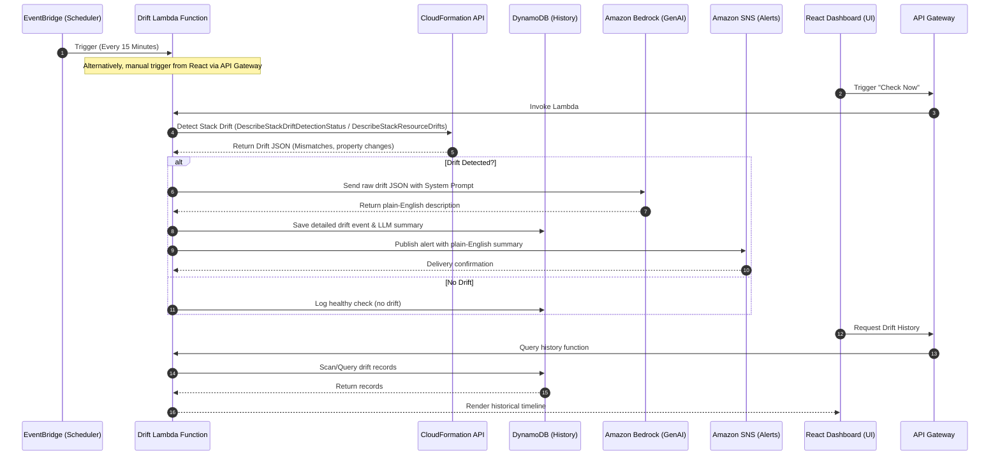

# Infrastructure Drift Detection & Response System

An automated, serverless system to monitor AWS CloudFormation stacks for infrastructure drift (mismatches between live resources and the IaC templates). When drift is detected, it logs the event in DynamoDB, uses Amazon Bedrock (LLM) to translate the raw drift JSON into a friendly, plain-English summary, and sends real-time alerts via SNS. A React-based web dashboard allows administrators to view the drift timeline, trigger manual checks, and inspect what changed.

---

## Architecture & Workflow

The system is fully built on AWS services and follows this execution sequence:



---

## AWS Pricing Breakdown: Free Tier vs. Paid Services

All services in this stack are cloud-native AWS services. Below is the breakdown of pricing and eligibility for the AWS Free Tier (as of 2026):

| AWS Service | Role in Project | Free Tier Eligibility | Estimated Cost (Low Volume / Sandbox) | Paid Status |
| :--- | :--- | :--- | :--- | :--- |
| **AWS EventBridge** | Schedules Lambda every 15 minutes | **14 million** events/month free | $0.00 (under 3,000 runs/month) | **Free Tier covers it** |
| **AWS Lambda** | Core execution logic (Python/Node.js) | **1 million** requests & **400,000 GB-seconds** of compute time/month free | $0.00 (under 3,000 runs/month) | **Free Tier covers it** |
| **AWS CloudFormation** | Drift Detection API | **Free** to use for drift detection within your account | $0.00 | **Free** |
| **Amazon DynamoDB** | Database for drift history and logs | **25 GB** storage, **25 WCU**, and **25 RCU** free | $0.00 (under light sandbox usage) | **Free Tier covers it** |
| **Amazon Bedrock** | GenAI translation (Claude 3/Llama 3/Titan) | **No permanent free tier** for Bedrock. | Pay-per-token: ~$0.0003–$0.001 per run. ~**$0.03/month** for daily/hourly checks. | **Paid Service** |
| **Amazon SNS** | Push email alerts | **1 million** publishes and **1,000 email deliveries** per month free | $0.00 | **Free Tier covers it** |
| **Amazon API Gateway** | API endpoints for React frontend | **1 million** API calls per month free | $0.00 | **Free Tier covers it** |
| **AWS CloudTrail** *(Stretch)* | Tracking WHO made changes | **First copy** of management events per region is free. 90-day search history is free. | $0.00 | **Free Tier covers it** |

> [!WARNING]
> While most resources fit comfortably inside the **AWS Free Tier**, **Amazon Bedrock is a paid-only service** (no free tier credits for model invocations). However, for a sandbox project run every 15 minutes or triggered manually, the monthly cost of Bedrock is extremely low (a fraction of a dollar).

---

## GenAI & ML Workflow Details

To explain the complex CloudFormation drift JSON in natural language, we use **Amazon Bedrock**.

### 1. Selected Model
We will use a highly efficient, fast, and cost-effective text generation model:
* **Anthropic Claude 3.5 Haiku** (`anthropic.claude-3-5-haiku-20241022-v1:0`) OR **Meta Llama 3 8B Instruct** (`meta.llama3-8b-instruct-v1:0`). Both are extremely cheap and excel at JSON translation tasks.

### 2. Prompt Engineering Schema
The Lambda function extracts the list of resource drifts. For each drifted resource, it formats a prompt with:
* The resource type (e.g., `AWS::EC2::SecurityGroup`)
* The resource physical ID (e.g., `sg-0abc123d45ef67890`)
* The property differences (e.g., ingress rule additions or modifications)

**System Prompt Example:**
```text
You are an AWS Cloud Security and Operations expert assistant. Your job is to translate complex infrastructure drift JSON details into a single, concise, human-readable sentence.
Do not output any introductory or concluding text. Output ONLY the single sentence.
Focus on:
1. What resource drifted (name and type).
2. What specific change was made (e.g., port opened, instance type upgraded).
3. The security/operational impact, if any.

Example Output:
"Security Group sg-0abc123d45ef67890 now allows public SSH ingress on Port 22 from 0.0.0.0/0."
```

### 3. API Invocation Pattern
In Python (Lambda Boto3), we invoke Bedrock using the newer `converse` API:
```python
import boto3
import json

bedrock = boto3.client('bedrock-runtime', region_name='us-east-1')

def generate_drift_summary(drift_json):
    system_prompt = "You are an AWS Cloud expert. Translate the raw CloudFormation drift JSON into a single concise English sentence."
    user_message = f"Here is the drift JSON:\n{json.dumps(drift_json, indent=2)}"
    
    response = bedrock.converse(
        modelId="anthropic.claude-3-5-haiku-20241022-v1:0",
        messages=[{"role": "user", "content": [{"text": user_message}]}],
        system=[{"text": system_prompt}],
        inferenceConfig={
            "maxTokens": 100,
            "temperature": 0.1
        }
    )
    return response['output']['message']['content'][0]['text']
```

---

## User Review Required

> [!IMPORTANT]
> 1. **AWS Bedrock Region**: Bedrock is not available in all AWS regions. We recommend deploying the Lambda function or Bedrock client calls in `us-east-1` (N. Virginia) or `us-west-2` (Oregon), where model access is easiest to request.
> 2. **Model Access Request**: Before running the Lambda, you must manually log into the AWS Console, navigate to Amazon Bedrock -> **Model access**, and request access to **Claude 3.5 Haiku** or **Llama 3 8B**. This takes under 5 minutes to approve but is required.

---

## Proposed Changes

To build this application, we propose the following structure in the workspace:

### 1. Infrastructure Deployment (IaC)

#### [NEW] [template.yaml](file:///c:/Users/bigha/OneDrive/Desktop/AWS_project/template.yaml)
An AWS SAM (Serverless Application Model) or CloudFormation template to deploy:
* DynamoDB table (`DriftHistory`)
* Lambda function (`DriftDetectorFunction`) with IAM roles for CloudFormation read, Bedrock invocation, SNS publishing, and DynamoDB writes.
* EventBridge scheduler rule triggering the Lambda every 15 minutes.
* SNS Topic for alerts.
* API Gateway REST endpoints to trigger check and fetch logs.

### 2. Backend Code

#### [NEW] [lambda/drift_detector.py](file:///c:/Users/bigha/OneDrive/Desktop/AWS_project/lambda/drift_detector.py)
The Python Lambda code that:
1. Triggers drift detection on the target CloudFormation stacks.
2. Checks status until complete.
3. Retrieves detailed resource drifts.
4. Sends the JSON to Bedrock for translation.
5. Persists the results in DynamoDB.
6. Publishes to SNS if new drift is discovered.
7. Supports a manual invoke payload from the Dashboard.

#### [NEW] [lambda/history_retriever.py](file:///c:/Users/bigha/OneDrive/Desktop/AWS_project/lambda/history_retriever.py)
A lightweight Python Lambda function to query the DynamoDB history and return a clean JSON payload to the React frontend.

### 3. Frontend Dashboard

#### [NEW] [dashboard/](file:///c:/Users/bigha/OneDrive/Desktop/AWS_project/dashboard/)
A modern, rich React + Tailwind CSS dashboard with:
* A visual timeline/history feed of drift events.
* A "Check Now" button which triggers the manual API Gateway check.
* Detailed card views showing the "Friendly English Description" vs the raw JSON diff.

---

## Verification Plan

### Automated/Local Tests
- Local Python unit tests for parsing drift JSON and formatting Bedrock prompts.
- Mocking Boto3 Bedrock runtime calls to test model formatting.

### Manual Verification
1. Deploy the test infrastructure stack (e.g. an EC2 instance or a Security Group via a target CFN template).
2. Manually modify a rule in the AWS Console (e.g. open Port 22/80 to public).
3. Trigger the manual "Check Now" button on the dashboard.
4. Verify the dashboard updates with the drift entry, Bedrock output describes the exact modification in plain English, and an email notification is delivered.
5. Revert the manual change and verify a healthy status is logged.
